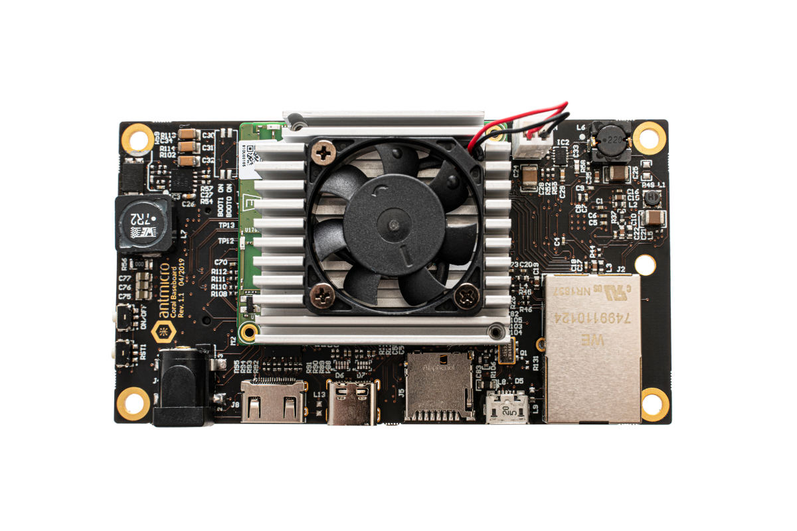
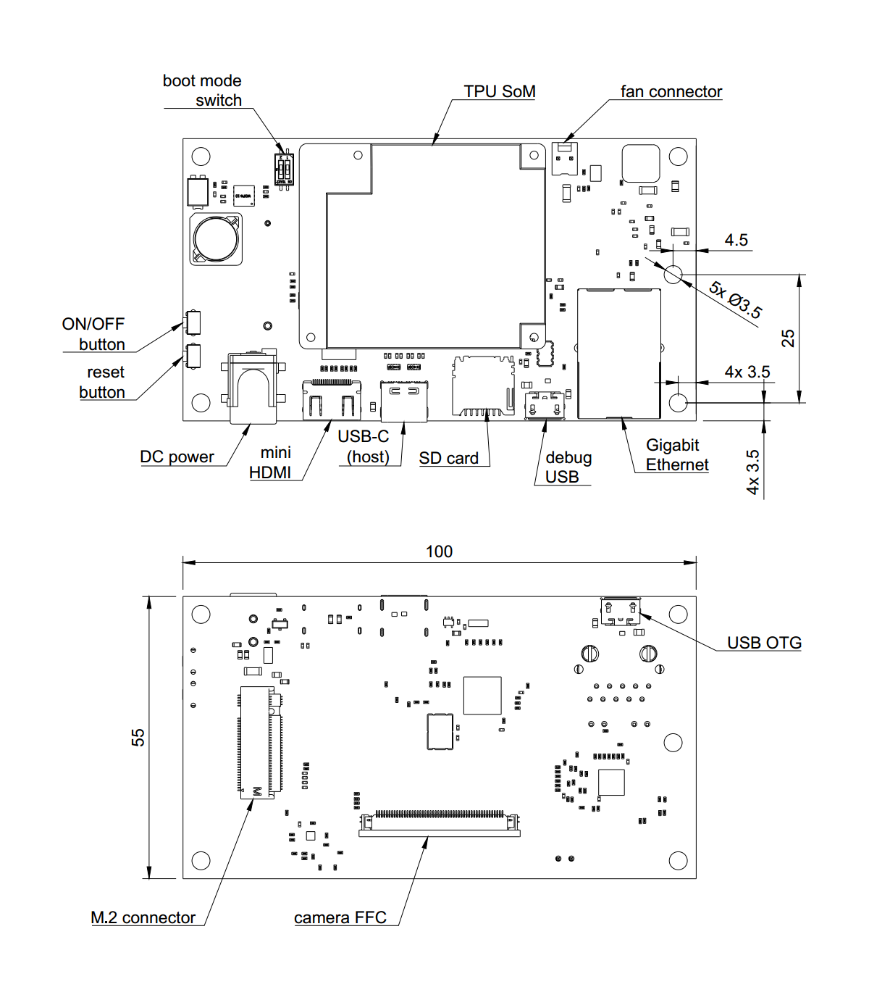

=================================
Antmicro's Google Coral Baseboard
=================================

Copyright (c) 2019-2021 `Antmicro <https://www.antmicro.com>`_

Overview
========

This repository contains open hardware design files for a baseboard supporting the `Google Coral SoM <https://coral.withgoogle.com/products/som>`_ with NXP i.MX8X and Google's Edge TPU ML inference ASIC (also available as part of the `Coral Edge TPU Development Board <https://coral.withgoogle.com/products/dev-board>`_), created by `Antmicro <http://www.antmicro.com>`_.
The board provides standard I/O interfaces and allows the user to interface with two MIPI CSI-2 compatible video devices over a unified Flexible Flat Cable (FFC) connector.

Key features
============

* Interface connectors for the Coral Edge TPU module
* Gigabit Ethernet RJ45 connector
* Micro USB serial debug connector
* Micro SD card interface
* 50-pin FFC connectors exposing MIPI CSI-2 camera interfaces
* USB-C DFP (Host) port
* Mini HDMI video output interface
* Integrated DC/DC power supply accepting 6-36VDC of input voltage

The PCB project files were prepared in Altium Designer 14.1.

Board layout & dimensions
=========================

The picture below presents the general layout of the PCB with IO interfaces marked.

Getting started
===============

The board can be produced and assembled using the provided design files.
Please take a look at the mechanical layers for more information regarding the PCB stackup recommended for fabrication.
The board accepts power supply voltage in the 6-36VDC range.
It is recommended to use a 12V 2A DC supply to power the board.
The board has an integrated power sequencer that starts the module automatically right after applying the power supply.
Please refer to the Coral documentation for more details regarding the `flashing procedure <https://coral.withgoogle.com/tutorials/devboard-reflash/>`_.

Debug UART connection
---------------------

Most of the debug messages are provided through the serial console.
The board is equipped with an FTDI chip exposing both UART interfaces to the host PC.
Please refer to the schematic sheets for more details.
The default debug UART channel is accessible through ``/dev/ttyUSB0`` (assuming that there are no other FTDI units connected to your PC).
The default baudrate for the serial debug connection is 115200 baud with 8-bit transmission, 1 stop bit and with no flow control.
